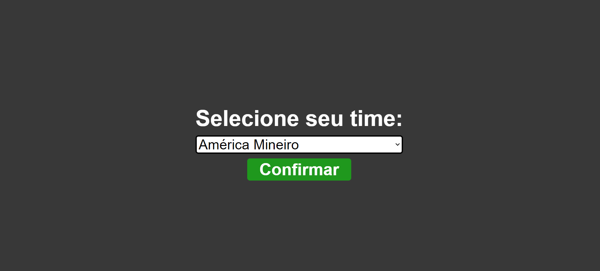
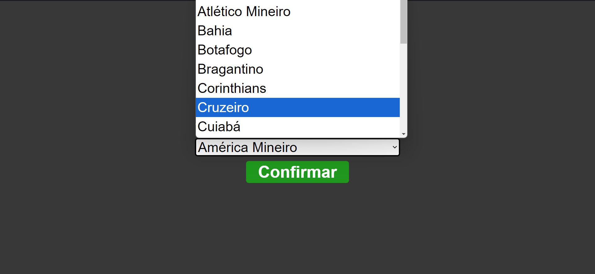
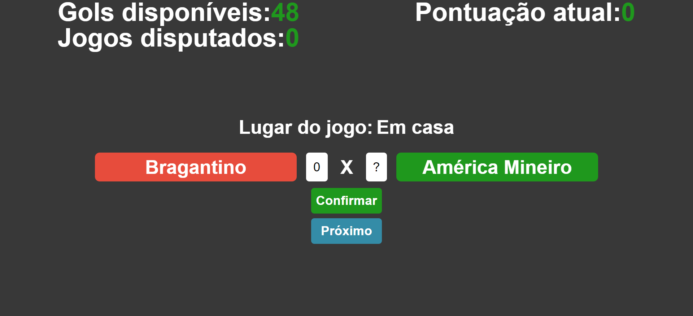
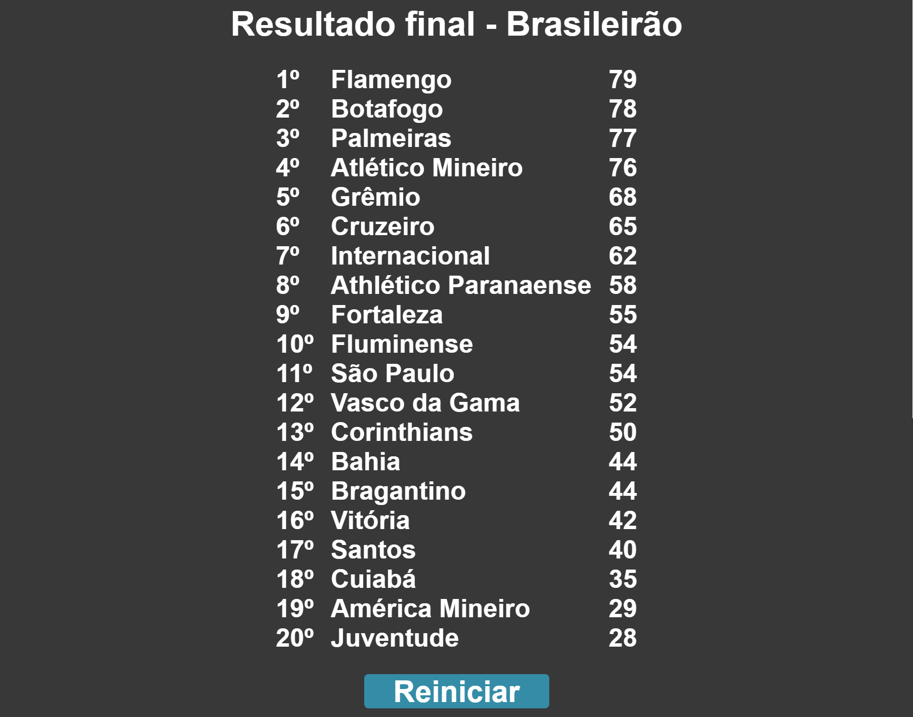

# Brazilian championship simulator

This project is a Brazilian football championship simulator, where the user can select an available team and simulate round by round with the aim of achieving a good result within the game.

## How to play

### Team selection screen:

On the home screen, the user must select the team that will play. The team options are as follows, and they are ordered in alphabetical order, but you can see the list below from best to worst within the game:

- Flamengo
- Palmeiras
- Atlético Mineiro
- Botafogo
- Cruzeiro
- Grêmio
- São Paulo
- Fluminense
- Internacional
- Athlético Paranaense
- Corinthians
- Santos
- Bragantino
- Vasco da Gama
- Fortaleza
- Bahia
- Cuiabá
- Juventude
- Vitória
- América Mineiro

Below is the team selection screen:

### Main screen:

The main screen is where the game actually takes place.

Within this screen, there is some relevant information.

The page header states:

- **Available goals**: refers to the number of available goals that the user will have to use throughout the championship. It is worth mentioning that the user will not be able to use more goals throughout the championship than are available, so they must use them with caution.
- **Games played**: refers to the number of games that have already been played by the user. The Brazilian championship has 38 rounds, so when he plays this number of games the championship ends.
- **Current score**: refers to the score that the team chosen by the player has already achieved during the championship. The scoring rules are the same as in real life, i.e. 3 points earned for a win, 1 point earned for a draw and 0 points earned for a loss. The team's score will directly affect the final championship ranking.

In the center of the page you can see the following:

- **Player's team**: refers to the team that the player initially selected;
- **Player's goals field**: this is a field with numerical input that the user can use to inform how many goals his team will score in the match in question;
- **Opponent's goal field**: this is a field that will display the number of goals scored by the opponent. Before the user confirms the number of goals their team will score, this field will be filled in with a question mark ("?"). When the user confirms the number of goals their team will score, the opponent's number of goals will be displayed;
- **Opposing team**: refers to the team that the player is facing in the round in question.

At the bottom of the page there are two buttons:

- **Confirmation button**: this button is used by the user to confirm the number of goals that their team will score in the game in question;
- **Continue button**: this button is used after the match result is confirmed, allowing the user to advance to the next round of the championship.

Below you can see an image of this screen:

### Final classification screen

The final classification screen is accessed after the user has already played the 38 rounds of the Brazilian championship. On this screen, the final classification is possible, where all teams, positions in the championship and their respective scores are listed.

Below you can see an imagne of this screen:

### Useful tips

Useful Tips:

The number of goals your opponent will score against your team is based on three main factors:

- Strength of your team;
- Strength of your opponent's team;
- Game location (in home games you have more chances of winning and away from home the opponent tends to score more goals).

In addition to these factors, there is also the possibility of luck or bad luck that cannot be predicted by logic alone.
